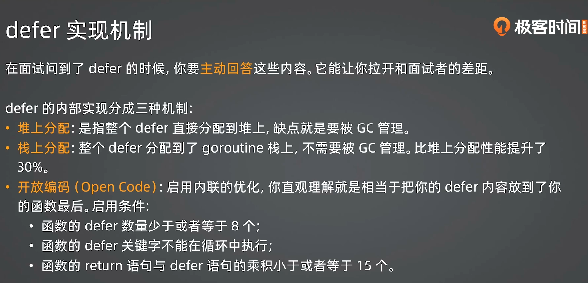

# GoGeekCampNote
## 2025.09.15 One Week
## two week interview important 
1. 什么是闭包？闭包有什么缺陷？
   闭包是指函数可以访问其外部作用域中的变量，即使在函数被定义的作用域已经结束后仍然可以访问。
   缺陷： 内存泄漏风险：闭包会持有外部变量的引用，可能导致垃圾回收器无法及时回收 
   性能开销：访问外部变量比访问局部变量慢 
    调试困难：变量的生命周期变得复杂

2. 什么情况下会出现栈溢出？
无限递归：函数无限制地调用自身
递归深度过大：递归层数超过栈空间限制
局部变量过大：在栈上分配过大的数组或结构体
函数调用链过深：正常函数调用但层次太多
3. 什么是不定参数？
   不定参数（可变参数）允许函数接收任意数量的参数，使用...语法定义。
可以传入0个值：func(args ...int) 调用时可以不传参数
内部使用：在函数内部，不定参数表现为切片类型
```go
gofunc sum(nums ...int) int {
total := 0
for _, num := range nums {
total += num
}
return total
}
```
4. 什么是defer？运作机制？
   defer是Go语言的延迟执行语句，在函数返回前执行。
   运作机制：
        延迟函数的参数在defer语句执行时就确定
        多个defer按LIFO（后进先出）顺序执行
        即使函数发生panic，defer也会执行
        在return语句执行后、函数真正返回前执行

5. 一个方法内部defer能不能超过8个？
   可以超过8个。Go语言对defer的数量没有硬性限制，只受内存限制。不过过多的defer会影响性能。
6. 
6. defer内部能不能修改返回值？怎么改？
   可以修改，但需要使用命名返回值：
   gofunc example() (result int) {
   defer func() {
   result = 100  // 可以修改命名返回值
   }()
   return 42  // 最终返回100
   }
7. 数组和切片有什么区别？
   特性数组切片长度固定，编译时确定动态，运行时可变类型值类型引用类型传递值传递（复制）引用传递声明[5]int[]int
8. 切片怎么扩容的？
   切片扩容遵循以下规则：
    如果新容量大于两倍旧容量，直接使用新容量
    如果旧容量小于256，新容量为旧容量的2倍
    如果旧容量大于等于256，新容量约为旧容量的1.25倍
    最终会根据元素类型进行内存对齐调整